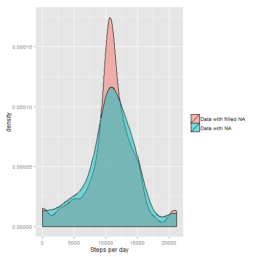

<br>

## Loading and preprocessing the data

Let`s load required data and make a quick overview:

```r
ac <- read.csv("activity.csv", sep=",")
head(ac)
```

```
##   steps       date interval
## 1    NA 2012-10-01        0
## 2    NA 2012-10-01        5
## 3    NA 2012-10-01       10
## 4    NA 2012-10-01       15
## 5    NA 2012-10-01       20
## 6    NA 2012-10-01       25
```

```r
summary(ac)
```

```
##      steps                date          interval     
##  Min.   :  0.00   2012-10-01:  288   Min.   :   0.0  
##  1st Qu.:  0.00   2012-10-02:  288   1st Qu.: 588.8  
##  Median :  0.00   2012-10-03:  288   Median :1177.5  
##  Mean   : 37.38   2012-10-04:  288   Mean   :1177.5  
##  3rd Qu.: 12.00   2012-10-05:  288   3rd Qu.:1766.2  
##  Max.   :806.00   2012-10-06:  288   Max.   :2355.0  
##  NA's   :2304     (Other)   :15840
```
<br>
  
## What is mean total number of steps taken per day?

Let`s group data by days and calculate mean and median:

```r
acg <- aggregate(ac$steps, list(ac$date), sum)
head(acg)
```

```
##      Group.1     x
## 1 2012-10-01    NA
## 2 2012-10-02   126
## 3 2012-10-03 11352
## 4 2012-10-04 12116
## 5 2012-10-05 13294
## 6 2012-10-06 15420
```

```r
hist(unlist(acg[2]), xlab = "Steps per day", main = "Histogram of the total number of steps taken each day", col = "orangered", breaks = 10)
```

 
<br>

```r
macg <- mean(acg[,2], na.rm=TRUE)
macg
```

```
## [1] 10766.19
```
The **mean** total number of steps per day is **10766.19**.    
<br>

```r
macg <- median(acg[,2], na.rm=TRUE)
macg
```

```
## [1] 10765
```
The **median** total number of steps per day is **10765**.  
<br>
<br>

## What is the average daily activity pattern?

Make a time series plot (i.e. type = "l") of the 5-minute interval (x-axis) and the average number of steps taken, averaged across all days (y-axis)

```r
acgi <- aggregate(ac$steps, list(ac$interval), mean, na.rm=TRUE)
head(acgi)
```

```
##   Group.1         x
## 1       0 1.7169811
## 2       5 0.3396226
## 3      10 0.1320755
## 4      15 0.1509434
## 5      20 0.0754717
## 6      25 2.0943396
```

```r
plot(unlist(acgi[1]), unlist(acgi[2]), type = "l", col = "dodgerblue3", lwd=2, xlab = "5-minute intervals", ylab = "The average number of steps taken")
```

 
<br>  
Which 5-minute interval, on average across all the days in the dataset, contains the maximum number of steps?

```r
int_max_steps <- acgi[acgi[2]==max(acgi[2])][1]
int_max_steps
```

```
## [1] 835
```
It is **835-th** interval.  
<br>
<br>

## Imputing missing values

Note that there are a number of days/intervals where there are missing values (coded as NA). The presence of missing days may introduce bias into some calculations or summaries of the data.

Calculate and report the total number of missing values in the dataset (i.e. the total number of rows with NAs)


```r
tempac <- ac[is.na(ac$steps), ]
length(tempac[,1])
```

```
## [1] 2304
```

Total **2304** values are missing.
<br>

Let's restore missing values in the dataset by replacing NA with average values obtained at previous step.  
New dataset **restore_missing_ac** is equal to the original dataset but with the missing data filled in.


```r
restore_missing_ac <- ac

for(i in 1:nrow(restore_missing_ac)){
    if (is.na(restore_missing_ac[i,1])==TRUE) {
        restore_missing_ac[i,1] <- acgi[acgi[1]==restore_missing_ac[i,3]][2]
    }
}
head(restore_missing_ac) ## Just to check that first rows contain values instead of NA's
```

```
##       steps       date interval
## 1 1.7169811 2012-10-01        0
## 2 0.3396226 2012-10-01        5
## 3 0.1320755 2012-10-01       10
## 4 0.1509434 2012-10-01       15
## 5 0.0754717 2012-10-01       20
## 6 2.0943396 2012-10-01       25
```
<br>

Make a histogram of the total number of steps taken each day and Calculate and report the mean and median total number of steps taken per day. Do these values differ from the estimates from the first part of the assignment? What is the impact of imputing missing data on the estimates of the total daily number of steps?


```r
restored_acg <- aggregate(restore_missing_ac$steps, list(restore_missing_ac$date), sum)
head(restored_acg)
```

```
##      Group.1        x
## 1 2012-10-01 10766.19
## 2 2012-10-02   126.00
## 3 2012-10-03 11352.00
## 4 2012-10-04 12116.00
## 5 2012-10-05 13294.00
## 6 2012-10-06 15420.00
```

```r
hist(unlist(restored_acg[2]), xlab = "Steps per day", main = "Histogram of the total number of steps taken each day", col = "dodgerblue", breaks = 10)
```

 
<br>  

Not enough clearly?  
Let's compare two histograms on one panel. Now we see the difference better.  


```r
hist(unlist(restored_acg[2]), xlab = "Steps per day", main = "Histogram of the total number of steps taken each day", col="dodgerblue", breaks = 10)
hist(unlist(acg[2]), xlab = "Steps per day", main = "Histogram of the total number of steps taken each day", col="orangered", breaks = 10,  add = TRUE)
```

 
<br>

And we can try same stuff with ggplot2.  


```r
grouped_data_with_NA <- acg[2]
grouped_data_restored_NA <- restored_acg[2]

grouped_data_with_NA$val <- 'Data with NA'
grouped_data_restored_NA$val <- 'Data with filled NA'

compare_data <- rbind(grouped_data_with_NA, grouped_data_restored_NA)

library("ggplot2")
ggplot(compare_data, aes(x, fill = val)) + geom_histogram(alpha = 0.6, aes(y = ..density..), position = 'identity', binwidth = 2000/3)+guides(fill=guide_legend(title=NULL)) + xlab("Steps per day")
```

 

```r
ggplot(compare_data, aes(x, fill = val)) + xlab("Steps per day") + geom_density(alpha = 0.5, xlab="Steps per day")+guides(fill=guide_legend(title=NULL))
```

 
<br>
We can draw the following conclusion:  
Number of days with an average number of steps (10766) grown because we have replaced all missing values (NA) by this value.

<br>


```r
macg <- mean(restored_acg[,2])
macg
```

```
## [1] 10766.19
```
The **mean** total number of steps per day for restored values is **10766.19**.    
<br>

```r
macg <- median(restored_acg[,2])
macg
```

```
## [1] 10766.19
```
The **median** total number of steps per day for restored values is **10766.19**.  
<br>
**The mean value is the same as before** because we used mean data to restore missing values.   
**Median became closer to the mean** since we reduced the variation in the sample, adding the missing data.

<br>
<br>

## Are there differences in activity patterns between weekdays and weekends?

For this part the weekdays() function may be of some help here. Use the dataset with the filled-in missing values for this part.

Create a new factor variable in the dataset with two levels – “weekday” and “weekend” indicating whether a given date is a weekday or weekend day.

```r
restore_missing_ac$daytype = ifelse(as.POSIXlt(as.Date(restore_missing_ac$date))$wday%%6 == 
    0, "weekend", "weekday")
restore_missing_ac$daytype = factor(restore_missing_ac$daytype, levels = c("weekday", "weekend"))
```
<br>
Make a panel plot containing a time series plot (i.e. type = "l") of the 5-minute interval (x-axis) and the average number of steps taken, averaged across all weekday days or weekend days (y-axis). See the README file in the GitHub repository to see an example of what this plot should look like using simulated data.
<br>

```r
restore_missing_acg <- aggregate(steps ~ interval + daytype, restore_missing_ac,  mean)

library(lattice)
xyplot(steps ~ interval | daytype, data = restore_missing_acg, layout = c(1, 2), type = "l")
```

 
  
Compared with weekends at weekdays we can see the peak activity at 9AM and several lower amplitude of activity throughout the day.

<br>
<br>
<hr>
<p>Read to the end?</p>
<p>Thank you!</p>
<p>Get some <a href="http://imgur.com/gallery/H9o39">brave cats</a> in reward.</p>


